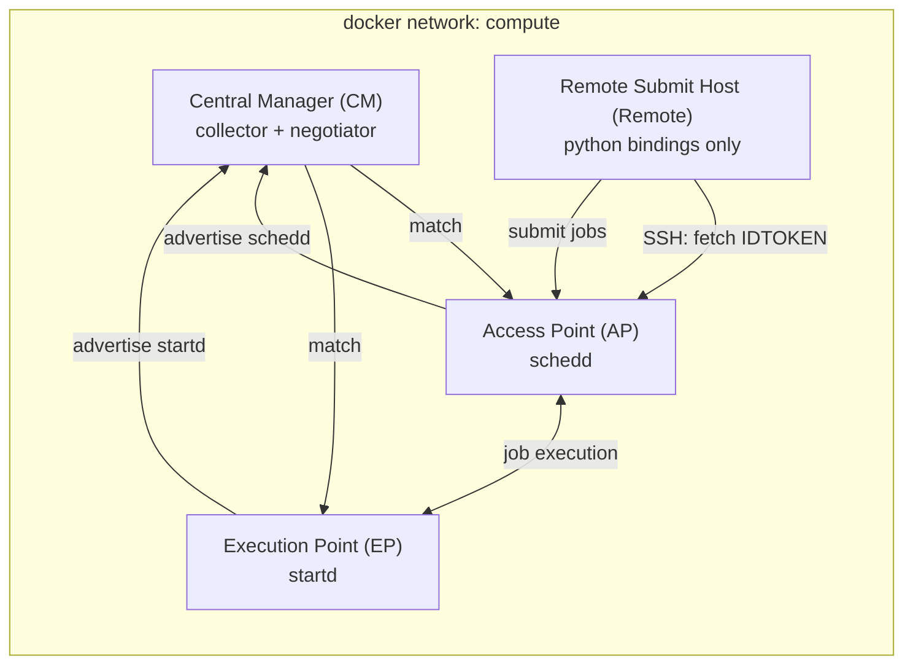

# Miniature Dockerized HTCondor System

A small, self-contained [HTCondor](https://htcondor.org/) system built with Docker Compose — useful for demos, testing, and learning how an HTCondor system fits together, without needing real hardware.

## Architecture



- Central Manager: Host machine in charge of matching jobs to resources
- Access Point: Host machine that manages/tracks user jobs
- Execution Point: Host machine that executes user jobs
- Remote: Host machine with only python API installed for remote AP job placement

> [!NOTE]
> This miniature system is set up to use IDTOKEN authentication
> for everything.

## Docker Configuration

Controls pool configuration defined in `.env`.

| Option | Purpose | Applied at |
|---|---|---|
| CM_HOST | Central Manager hostname | image build |
| AP_HOST | Access Point hostname | image build |
| EP_HOST | Execution Point hostname | image build |
| REMOTE_HOST | Remote submission hostname | image build |
| SECRET | Shared secret for daemon idtoken signing | image build |
| USER_PASSWORD | User password for ssh access | image build |
| USER_NAME | Username for ssh access and job submission | image build |
| AP_TESTING_MOUNT | Host directory bind-mounted for testing on AP (default `./shared/mount/ap`) | container start |
| REMOTE_TESTING_MOUNT | Host directory bind-mounted for testing on Remote (default `./shared/mount/remote`) | container start |
| STAGING_MOUNT | Host directory bind-mounted at `/staging` on both AP and EP (default `./shared/staging`) | container start |

Edit the "image build" options before building if you want different hostnames, credentials, or the shared signing secret — see the rebuild note under Troubleshooting. The "container start" options take effect on the next `docker compose up` (what `./htc fly` runs), no rebuild required.

## HTCondor Configuration

Custom HTCondor configuration can be specified before building the docker
containers in the following two methods:

1. Add configuration file to `system/config/` to control HTCondor behavior
   on the AP, EP, and CM.
2. Update `remote/user.conf` to control behavior on the remote submission
   host.

## Getting files into a host

Two optional, host-specific bind mounts are wired up in `docker-compose.yaml`,
both no-ops (empty directories) unless you put something in them:

- `shared/copy/<host>/` (all four hosts) is copied into `/home/$USER_NAME/copy` on
  that host once, when the container boots. Use it to seed a host with files
  — the copy only happens at startup, so re-run `./htc perch && ./htc fly`
  (or `docker compose restart <host>`) to pick up changes.
- `shared/mount/ap/` and `shared/mount/remote/` are live read/write bind mounts at
  `/home/$USER_NAME/testing` on those hosts — changes on either side show up
  immediately, no restart needed. Handy for iterating on submit files or
  scripts without rebuilding images. The host-side path for each defaults to
  `./shared/mount/ap` and `./shared/mount/remote`, but can be pointed anywhere
  by setting `AP_TESTING_MOUNT` / `REMOTE_TESTING_MOUNT` in `.env` (e.g. to an
  existing directory of test files elsewhere on your machine).

`shared/staging/` (host-side, default; override with `STAGING_MOUNT` in
`.env`) is mounted at `/staging` on both `ap` and `ep`, mirroring CHTC's real
shared `/staging` drive between the AP and EPs. It's meant for large input
data a job pulls directly via HTCondor's `file://` transfer mechanism instead
of shipping it through the schedd:

```
transfer_input_files = file:///staging/my-big-input.dat
```

## Usage

The `htc` script wraps Docker Compose:

```
./htc fly       # build and start the system
./htc perch     # stop the system
./htc destroy   # stop the system and remove its images, volumes, and networks
./htc help      # usage
```

On startup it prints SSH login commands and the system user's password for each host.

## Logging in

```
ssh -p 2000 tweety@localhost   # Central Manager
ssh -p 2001 tweety@localhost   # Access Point
ssh -p 2002 tweety@localhost   # Execution Point
ssh -p 2003 tweety@localhost   # Remote submit host
```

## Submitting jobs

From `ap` (or `remote`), submit jobs as usual with `condor_submit`:

```
ssh -p 2001 tweety@localhost
condor_submit /path/to/job.sub
condor_q
```

`remote` has no local schedd — it submits through `ap` using the IDTOKEN it fetches at boot (see the Architecture note above).

## Troubleshooting

- **`remote` container logs repeat "Waiting for Access Point accessible via SSH"**: `ap` hasn't finished starting yet (or failed to start) — `remote` blocks on `condor_ping` over SSH to `ap` until it succeeds. Check `docker compose logs ap`.
- **Login fails / SSH connection refused**: give containers a few seconds after `./htc fly` for `sshd` and the HTCondor daemons to come up.
- **Rebuilding after changing `.env`**: `./htc perch` then `./htc fly` — hostnames and secrets are baked in at image build time via Dockerfile `ARG`s, so a plain restart won't pick up changes.

## Not for production

This is a demo/dev tool: passwords are stored in plaintext in `.env`, SSH allows password auth and root login, and the signing secret ships in the repo's default `.env`. Don't reuse these images or configs outside a local/throwaway environment.
