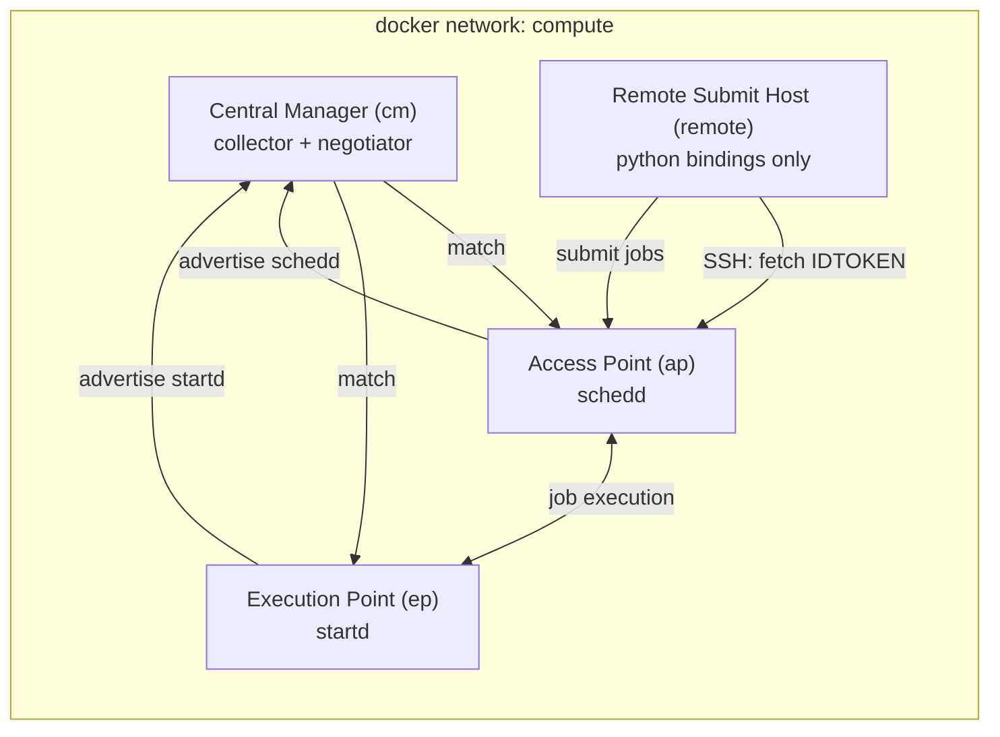

# mini-htcondor-docker-pool

A small, self-contained [HTCondor](https://htcondor.org/) pool built with Docker Compose — useful for demos, testing, and learning how an HTCondor pool fits together, without needing real hardware.

## What it builds

| Host | Role | SSH port |
|---|---|---|
| `cm` | Central Manager | 2000 |
| `ap` | Access Point (submit host) | 2001 |
| `ep` | Execution Point (worker) | 2002 |
| `remote` | Remote submit host (Python bindings only, no local HTCondor daemons) | 2003 |

All hosts share a single Docker network and authenticate to each other using IDTOKENs signed with a shared secret. The `remote` host fetches a submission token from the `ap` host over SSH at boot, so it can submit jobs to the pool without running its own daemons.

## Architecture



`cm` is the pool's collector/negotiator, `ap` hosts the schedd jobs are submitted to, and `ep` runs the startd that executes them. `remote` has no HTCondor daemons of its own — it only carries the Python bindings and a token good for submitting through `ap`.

## Authentication

- All three pool daemons (`cm`, `ap`, `ep`) are seeded with the same `SIGNING_SECRET` via `condor_store_cred`, which they use to mint and validate IDTOKENs for daemon-to-daemon auth.
- `cm`'s Dockerfile explicitly allows `ap` to advertise a schedd and `ep` to advertise a startd (`ALLOW_ADVERTISE_*`), so only those two hosts can register with the pool.
- `remote` submission uses a separate mechanism: `ap` generates its own random signing key at build time (`remote-signing-key`) just for issuing tokens to remote users. At container boot, `remote` SSHes into `ap`, runs `condor_token_fetch`, and stores the result at `~/.condor/tokens.d/ap-token` — that token is what lets it submit jobs without holding the pool's main signing secret.

## Requirements

- Docker and Docker Compose
- `sshpass` if you plan to SSH in without typing the password each time

## Configuration

Pool settings live in `.env`:

```
CM_HOST=cm.test.host
AP_HOST=ap.test.host
EP_HOST=ep.test.host
REMOTE_HOST=remote.test.host
SECRET=SuperSecretPassword
USER_PASSWORD=pass123
USER_NAME=tweety
```

Edit these before building if you want different hostnames, credentials, or the shared signing secret.

## Usage

The `htc` script wraps Docker Compose:

```
./htc fly     # build and start the pool
./htc perch   # stop the pool
./htc help    # usage
```

On startup it prints SSH login commands and the pool user's password for each host.

## Logging in

```
ssh -p 2000 tweety@localhost   # Central Manager
ssh -p 2001 tweety@localhost   # Access Point
ssh -p 2002 tweety@localhost   # Execution Point
ssh -p 2003 tweety@localhost   # Remote submit host
```

From `ap` (or `remote`), submit jobs as usual with `condor_submit`.

## Layout

```
docker-compose.yaml   # service definitions for cm, ap, ep, remote
htc                    # start/stop helper script
system/                # cm, ap, ep Dockerfiles + shared boot.sh + condor config
remote/                # remote submit host Dockerfile, boot.sh, user condor config
```

## Troubleshooting

- **`remote` container logs repeat "Waiting for Access Point accessible via SSH"**: `ap` hasn't finished starting yet (or failed to start) — `remote` blocks on `condor_ping` over SSH to `ap` until it succeeds. Check `docker compose logs ap`.
- **Login fails / SSH connection refused**: give containers a few seconds after `./htc fly` for `sshd` and the HTCondor daemons to come up.
- **Rebuilding after changing `.env`**: `./htc perch` then `./htc fly` — hostnames and secrets are baked in at image build time via Dockerfile `ARG`s, so a plain restart won't pick up changes.

## Not for production

This is a demo/dev tool: passwords are stored in plaintext in `.env`, SSH allows password auth and root login, and the signing secret ships in the repo's default `.env`. Don't reuse these images or configs outside a local/throwaway environment.
